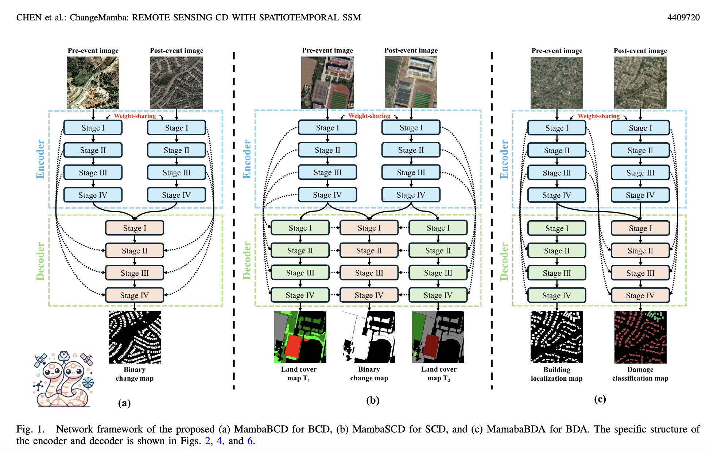
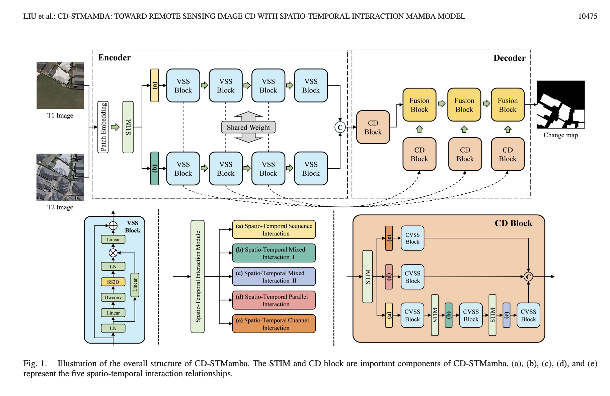
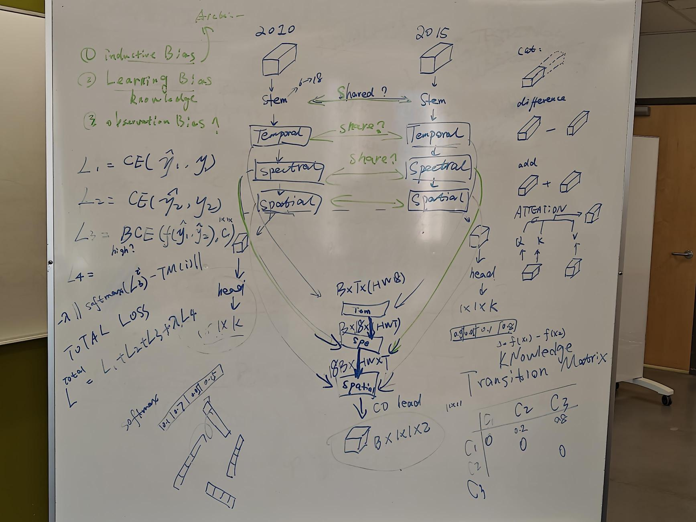

# Hackathon Project 3: Multi-task knowledge-guided spatial-temporal-spectral deformable Mamba for change detection from MODIS imagery

Welcome to the Hackathon project! This repository is designed for participants to work on novel multi-task knowledge-guided deformable spatial-temporal-spectral Mamba models for time-series change detection. To win the competition, follow the instructions below.

## Steps to Participate:

### 1. **Access the Dataset**

The dataset needed for this project, including the `MOD13Q1_sask_2010.tiff`, `MODISQ1_sask_2015.tif` and `sask_binary_change_2010_2015_gt.tif` files, are located in the following directory:

```
/mnt/raid/benchmark_datasets/MODIS/sask
```

You can access these files using **RaiDrive** software, which has been recommended by Zhengsen. If you don’t have it installed, follow these steps:
- Download **RaiDrive** from [here](https://www.raidrive.com/).
- Set it up according to the instructions to mount the remote storage location on your local system.
- You should now be able to access the dataset files directly from your computer.
- You will need to change the file locations in the model to /mnt/raid/benchmark_datasets/MODIS/sask/files

### 2. **Clone the GitHub Repository**

Clone this GitHub repository to your local machine:

```bash
git clone https://github.com/linlinxu-uc/hackathon3.git
cd hachathon3
```

### 3. **Create Your Own Branch**

Create a new branch using your own name so that you can make your changes without affecting the main codebase:

```bash
git checkout -b your_name
```

Make sure to replace `your_name` with your actual name or username.

### 4. **Set Up the Conda Environment**

Set up the required conda environment for this project. You can use your existing conda environment or create a new one. 


### 5. **Run the Baseline Code**

After setting up the environment, run the baseline code to ensure everything is working as expected:

```bash
python SDMamba_CD_4_losses.py
```
The baseline code is the starting point, and your task is to improve upon it.


### 6. **Improve the Baseline Code**


<div style="display: flex; justify-content: space-around; align-items: center; gap: 40px;">

  <figure style="margin: 0;">
    
    <figcaption style="text-align: center;">Architecture of paper in [2] </figcaption>
  </figure>
  
  <figure style="margin: 0;">
    
    <figcaption style="text-align: center;">Architecture of paper in [3] </figcaption>
  </figure>
  
  <figure style="margin: 0;">
    
    <figcaption style="text-align: center;">Architecture</figcaption>
  </figure>

</div>

Your goal is to **boost the accuracy** of the baseline model. Modify and improve the code to achieve better results. You may:
- Experiment with different spatial-temporal-spectral (STS) Mamba model architectures.
- Improve stem using temporal grouping
- Replace SDMamba with STS-SDMamba
- Add dedicated fusion module to fuse 2010 and 2015 branches
- Instead of using average pooling, gradually decreasing the size of the feature maps, or use weighted average approach where the weights are sparse_Attention matrix
- Use weight sharing between 2010 and 2015 branches
- Explore different fusion approaches, e.g., minus, plus, concatenation, attention-fusion, etc. 
- Try different hyperparameter tuning strategies.
- Utilize feature engineering or data augmentation to improve the model's performance.

### 7. **Track Accuracy and Submit Your Changes**

Once you have improved the model and achieved a better accuracy, commit your changes to your branch:

```bash
git add .
git commit -m "Improved accuracy"
git push origin your_name
```

The member with the highest accuracy will win the hackathon competition!

[1] Linlin Xu, L., Zhu, Y., Dewis, Z., Xu, Z., Alkayid, M., Heffring, M. and Taleghanidoozdoozan, S., 2025. Sparse Deformable Mamba for Hyperspectral Image Classification. arXiv e-prints, pp.arXiv-2504.

[2] Chen, H., Song, J., Han, C., Xia, J. and Yokoya, N., 2024. Changemamba: Remote sensing change detection with spatio-temporal state space model. IEEE Transactions on Geoscience and Remote Sensing.

[3] Liu, S., Wang, S., Zhang, W., Zhang, T., Xu, M., Yasir, M. and Wei, S., 2025. CD-STMamba: Towards Remote Sensing Image Change Detection With Spatio-Temporal Interaction Mamba Model. IEEE Journal of Selected Topics in Applied Earth Observations and Remote Sensing.

### 9. **Winner Announcement**

At the end of the competition, the team member with the highest accuracy score will be declared the winner. Good luck!

---

## Getting Help

If you run into any issues or have questions, feel free to reach out in the **Discussions** section of this repository or contact your teammates. We're all here to help!

Good luck, and may the best team win!


